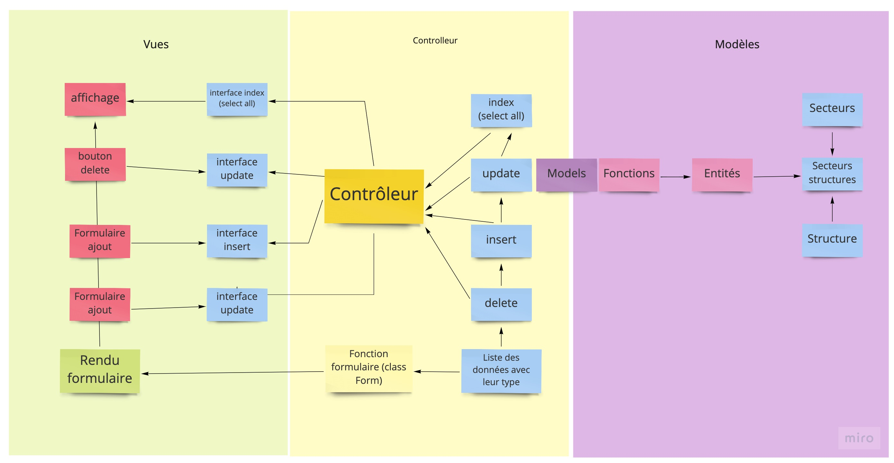

# Project PPO php - Rendu

### Base de donnée accès
---
**HOST : remotemysql.com** 
**BD Name : mVrrTxQ5nS**
**id :** mVrrTxQ5nS 
**pwd :** IL3tuUFSCQ

### Docs
---
**Constantes**

-  VF = 'Views/';
-  MD = 'Models/';

**MVC** 

**Modèle** 

**Cas spécifique association secteurs structures** 
&rarr; La jointure [Conntroller association s/s](SRC/Controllers/ControllerSecteursStructures.php)
Jointure récupérant toutes les données des tables associées
Fusionne les données en communs (id équivalents) dans une case de tableau 
On injecte ainsi dans les vues les données nécéssaires aux traitement
Les LEFT et RIGHT nous permettent de remplacer par des NULL si il n'y a pas d'association entre les deux tables
Aisni on se contente d'une seule requète SQL
